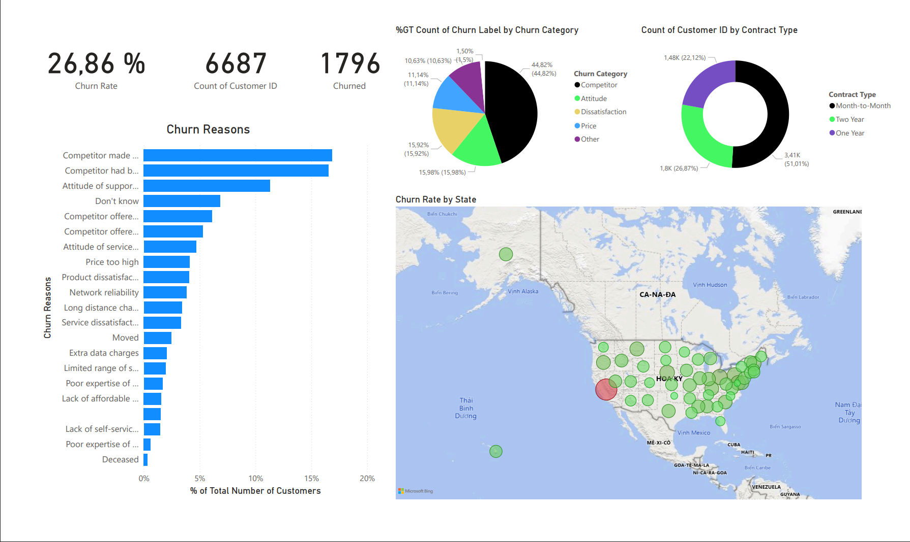
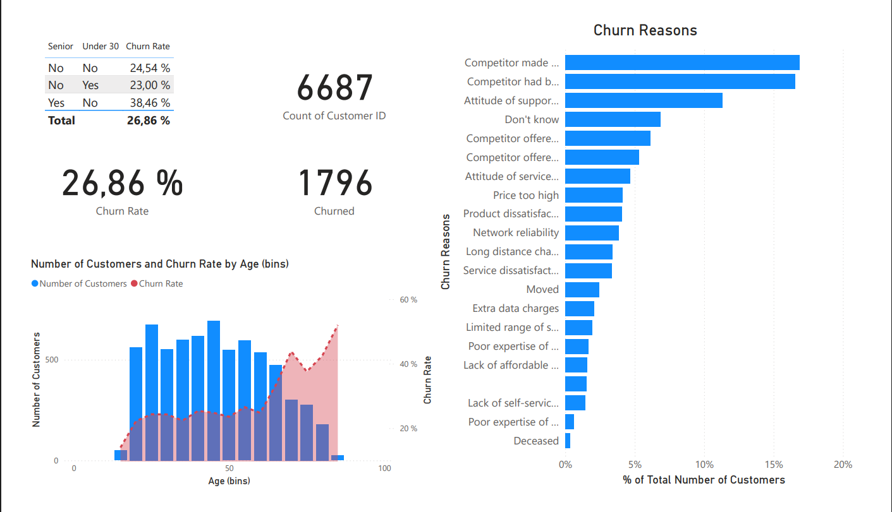
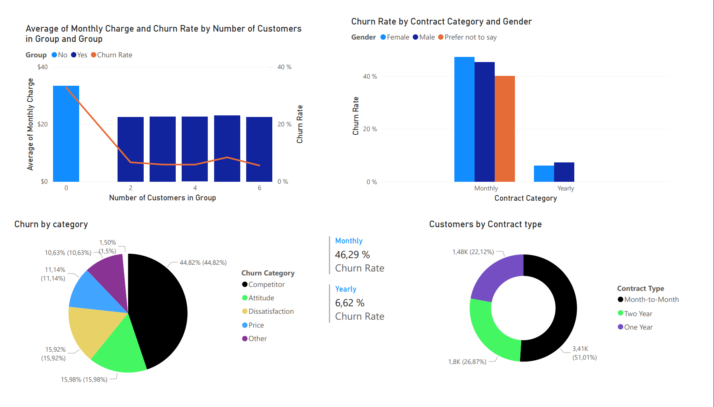
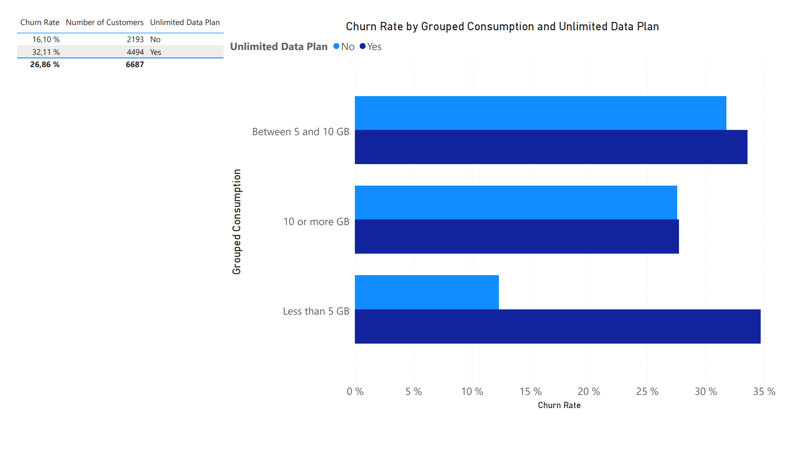
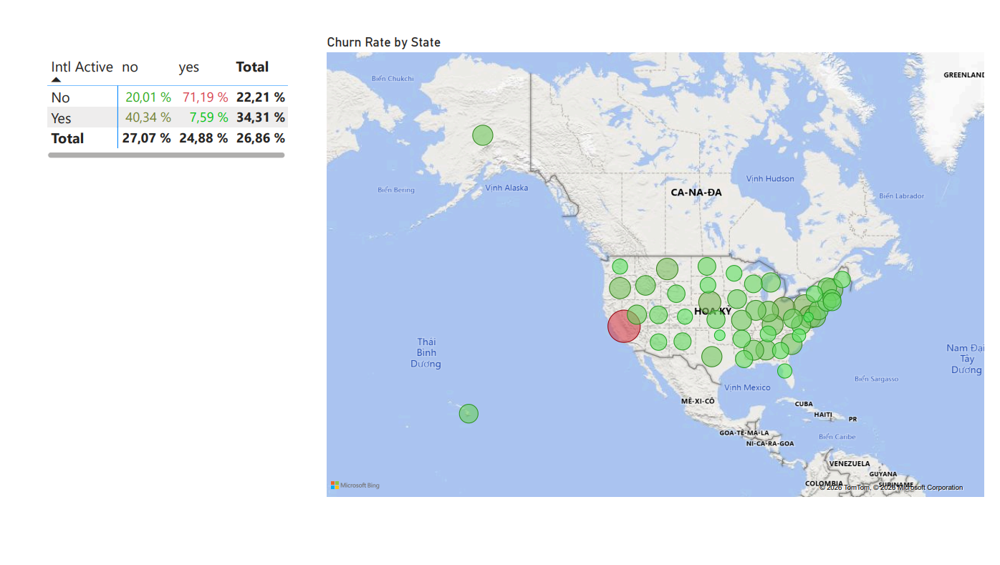
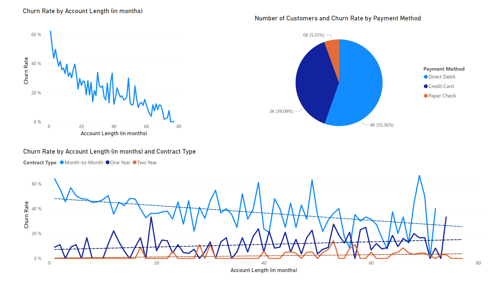
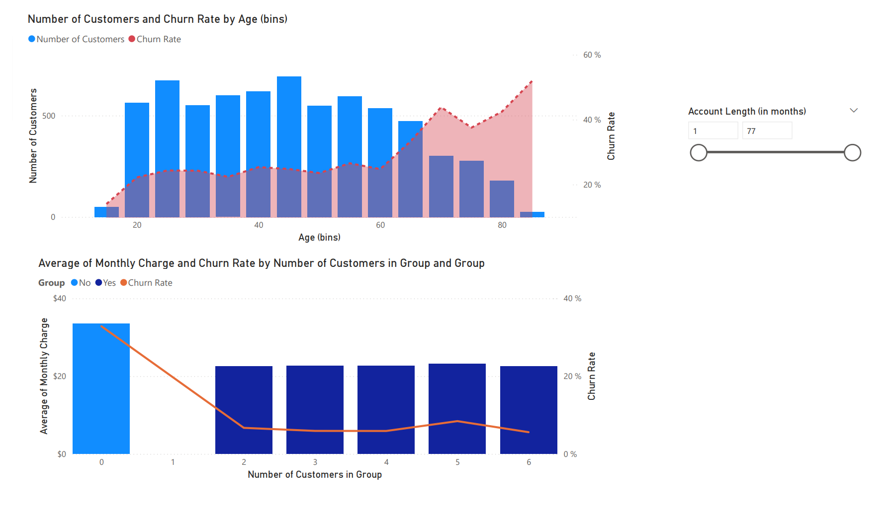
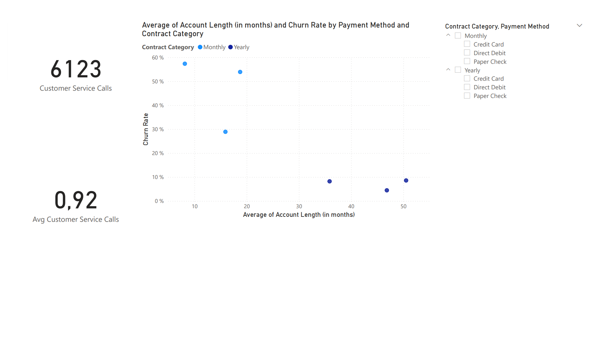
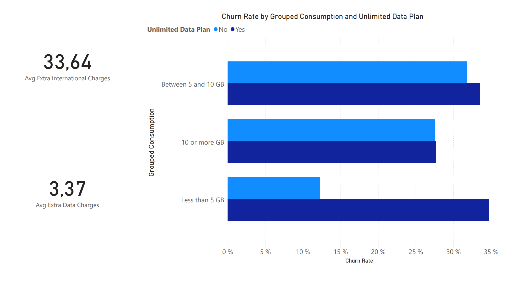

# Customer-Churn-Analysis-Databel
## The Business Challenge

Databel Telecom is facing a high customer churn rate of 26.86%. This means many customers are leaving the service, which can negatively affect the company’s revenue and market position. To solve this problem, Databel needs to understand why customers are leaving and which groups of customers are most likely to churn.

## Project Objective

This Power BI project aims to find the main reasons behind customer churn. By analyzing customer information, the dashboard helps turn large amounts of data into simple and easy-to-understand insights.

## Delivering Business Value

This project does more than just show data and numbers. It provides useful insights that can support better business decisions. With this dashboard, Databel’s management team can:

* **Identify high-risk customer groups:** Find out which customers are more likely to leave.
* **Respond to competitors:** Improve pricing and promotional offers to compete better with rival companies.
* **Improve customer experience:** Discover internal problems, such as poor support service, and take action to increase customer satisfaction and loyalty.
## Overview

Out of 6,687 customers, 1,796 have stopped using the service, resulting in a churn rate of 26.86%. This is quite a high number and shows that the company is having trouble retaining customers and needs to improve its retention strategies.

Competitors are the main reason customers leave, accounting for 44.82% of total churn cases. Most customers switch because competitors offer better prices or more attractive devices. This means Databel should review its pricing and promotions to remain competitive in the market.

Problems related to customer experience, such as poor service attitude and customer dissatisfaction, make up more than 31% of churn reasons. In particular, the support team’s attitude is one of the biggest issues. Improving customer service quality and staff training could help increase customer satisfaction.

More than half of the customers (51.01%) are using month-to-month contracts. These customers can leave easily because they are not tied to long-term agreements. The company should offer discounts or special benefits to encourage them to switch to 1-year or 2-year contracts.

The data shows that California has the highest churn rate. Databel should investigate this area further to understand the reasons, such as network problems or strong competition from local providers.
## Churn Demographics

Senior customers have the highest churn rate at 38.46%, while customers under 30 have a much lower churn rate of 23.00%. This shows that older customers are more likely to leave the service.

The churn rate remains stable among younger customers but increases significantly in older age groups, showing a strong connection between age and churn behavior.

Databel should focus on improving the experience for senior customers by offering simpler plans, user-friendly devices, and better customer support to reduce churn in this segment.
## Groups and Categories

Customers in group or family plans have lower churn rates compared to individual users. This suggests that shared or multi-line plans help increase customer loyalty and retention.

Customers using Month-to-Month contracts have a very high churn rate of 46.29%, while yearly contract users are much more stable with only 6.62% churn. This shows that long-term contracts help reduce customer loss.

Competitors are the biggest reason customers leave, accounting for 44.82% of churn cases. However, internal issues such as customer dissatisfaction and poor staff attitude also contribute significantly to customer loss.
## Unlimited Plan

Customers using Unlimited Data Plans have a much higher churn rate (32.11%) compared to customers on regular plans (16.10%). This shows that unlimited plans are a major high-risk segment for the company.

Customers who use less than 5 GB of data but still pay for an Unlimited Plan have the highest churn rate, close to 35%. This suggests that many customers feel they are paying too much for a service they do not fully use.

Databel should proactively identify low-data users on Unlimited Plans and offer cheaper plans that better match their usage. This could improve customer satisfaction, increase loyalty, and reduce churn in the long term.
## International Calls

Customers who make international calls without an international plan have an extremely high churn rate of 71.19%. This is likely because they face very expensive extra charges, causing frustration and leading them to leave the service.

Customers who pay for an international plan but rarely use it also have a high churn rate of 40.34%. In contrast, customers who both have and actively use the plan show a very low churn rate of only 7.59%.

The geographic analysis shows that California has a significantly higher churn level compared to other states, making it a major high-risk region for Databel.

Databel should offer international add-ons to customers who frequently make overseas calls and recommend cheaper plans to users paying for unused features. The company should also investigate the California market to identify possible service or competition issues.
## Contract Type

The churn rate is highest during the first few months of using the service, reaching nearly 60%, before becoming more stable over time. This shows that new customers are the most likely to leave.

Customers with Month-to-Month contracts continue to show high churn rates throughout their customer lifecycle, while customers with 1-year or 2-year contracts are much more stable.

Most customers use Direct Debit or Credit Card payments, while only a small percentage use Paper Check. Automatic payment methods help reduce missed payments and improve payment reliability.

Databel should improve the onboarding experience for new customers, encourage users to switch to long-term contracts, and promote auto-pay methods through discounts or rewards to reduce churn and stabilize revenue.
## Age groups

Customers over the age of 60 have a much higher churn rate, reaching over 40–50%, while younger and middle-aged customers remain relatively stable at around 20%. This suggests that older customers are more likely to leave the service.

Customers with individual accounts pay the highest monthly charges and also have the highest churn rate. In contrast, customers in group or family plans pay lower monthly costs and show much stronger loyalty.

Databel should improve services for senior customers and promote family or group plans through “Add-a-Line” offers to increase customer loyalty and reduce churn.
## Payment and Contract

Databel recorded 6,123 customer service calls, averaging 0.92 calls per customer. Since support attitude and customer dissatisfaction are major churn reasons, each customer interaction plays an important role in retention.

Customers with Month-to-Month contracts have shorter account lifespans and much higher churn rates, while Yearly contract customers stay longer and maintain very low churn rates.

Databel should use customer service interactions as an opportunity to improve retention. Support agents can offer discounts or special deals to encourage Month-to-Month customers to switch to long-term contracts after resolving their issues.
## Extra Charges

Extra international charges are much higher than extra data charges, which can cause “bill shock” when customers receive unexpectedly expensive bills. This may lead to frustration and higher churn.

Customers who use less than 5 GB of data but still subscribe to unlimited plans have a very high churn rate, close to 35%. This suggests that many customers feel they are paying for services they do not fully use.

Databel should send alerts when international charges become too high and recommend suitable add-ons. The company should also suggest cheaper plans for low-usage unlimited users to improve customer satisfaction and reduce churn.
## Conclusion
Reducing Databel Telecom’s 26.86% churn rate requires more than simply tracking numbers. The company needs proactive strategies that focus on improving customer experience and retention.

The analysis shows three key areas Databel should focus on:

* **Encouraging Long-Term Contracts:** Convert Month-to-Month customers into 1-year or 2-year contracts through discounts and special offers to create more stable revenue.
* **Optimizing Customer Plans:** Help customers switch to plans that better match their actual usage to reduce “bill shock” and improve customer satisfaction.
* **Improving Customer Support:** Strengthen the onboarding experience for new users and create targeted retention strategies for high-risk groups, especially senior customers.

Overall, this project demonstrates how data analysis can be used to turn raw data into meaningful business insights and support better strategic decisions to improve customer loyalty and reduce churn.
